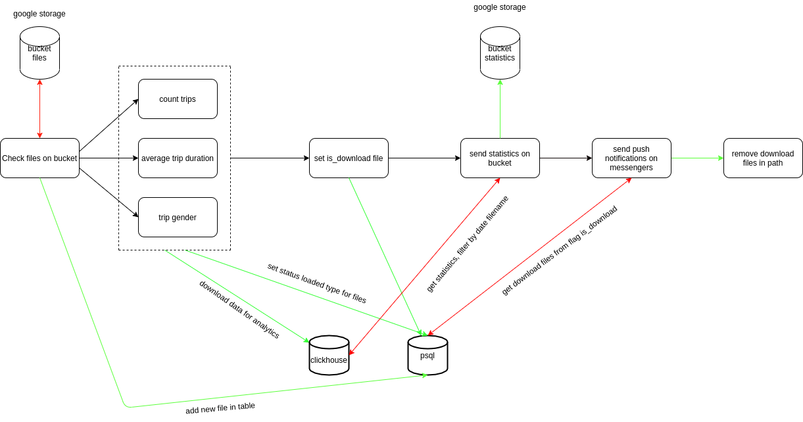

# DailyReportBicycleTrip
Пайплайн выгрузки ежедневных отчётов по количеству поездок на велосипедах в городе Нью-Йорк.

&#128578;

**I этап**

Загрузка данных в `clickhouse`:

* Кол-во поездок за 1 день
* Средняя продолжительность поездок
* Распределение поездок пользователей, разбитых по категории "gender"

Таблицы созданы на движке ``ReplacingMergeTree``, то есть будут убираться дубликаты.
Есть особенность что возможно не всегда и не везде они будут убираться.
В это случае есть запрос `OPTIMIZE` -> `OPTIMIZE TABLE [db.tablename] DEDUPLICATE;`
В случае использования `OPTIMIZE` тоже нельзя расчитывать на 100%.

Почему?
Информация из документации:
Дедупликация данных производится лишь во время слияний. 
Слияние происходят в фоне в неизвестный момент времени, на который вы не 
можете ориентироваться. Некоторая часть данных может остаться необработанной. 
Хотя вы можете вызвать внеочередное слияние с помощью запроса `OPTIMIZE`, 
на это не стоит рассчитывать, так как запрос OPTIMIZE приводит к чтению и записи большого объёма данных.

Таким образом, `ReplacingMergeTree` подходит для фоновой чистки дублирующихся данных в целях экономии места, но не даёт гарантии отсутствия дубликатов.
https://clickhouse.tech/docs/ru/engines/table-engines/mergetree-family/replacingmergetree/
Еще нашел такое решение кейса, перед загрузкой в `clickhouse` убрать дубликаты в `apache cassandra`

**II этап**

На данный момент загрузка данных выполняется с зависимостями от операторов, без использования ассинхронности.
То есть просто с запуском `Trigger DAG`

Дальше нужно будет сделать:

* refactor кода в месте где конвертируется дата
* Периодическая проверка файлов(если есть новые то запускаем полностью pipeline)
* Создать функцию, которая будет уведомлять о готовности файла в мессенджерах
* Обернуть в docker-compose

**Архитектура работы цепочки алгоритма**

